# DineIQ — Exploratory Data Analysis

Data: all orders from 2025-01-01 through 2025-12-31 (feature snapshot `as_of_date=2025-12-31`),
160 menu items, 25 locations. Revenue, volume and margin exclude cancelled
orders. Amounts are in PKR. Peak hours are 12:00-14:00 and 19:00-22:00; the weekend is
Friday-Sunday. Source notebook: `notebooks/01_eda.ipynb`. Feature definitions:
`spark_jobs/04_feature_engineering.py`.

## Headline numbers

| Metric | Value |
|---|---|
| Revenue (net of discounts, excl. tax) | 1,200.4M PKR |
| Gross margin | 56.5% |
| Completed orders | 179,324 |
| Ordering customers | 49,606 |
| Wastage cost | 28.5M PKR (2.4% of revenue) |
| Average dish rating | 3.70 / 5 |

## Key findings

- **Volume and margin are separate things.** 8 of the menu's lowest-margin dishes are
  also in the top 15% by volume (Doodh Patti Chai, Chicken Tikka Pizza (Medium), Zinger Burger, Plain Naan and others). They run at 29-35% margin,
  against a menu median of 59.4%. The 10 best sellers average
  39.8% margin. Across the menu, rank correlation between units sold and margin is
  -0.07, i.e. none.
- **Wastage is concentrated.** Six dishes account for 69% of all wastage cost,
  led by Mutton Karahi (Half), Chicken Karahi (Half), Chicken Handi. The Karahi & Handi category alone wastes
  16.3M PKR.
- **5 dishes are rated far below the rest** (Veg Spring Rolls, Beef Lasagna, Fish Burger, Cold Coffee, Mutton Pulao), at
  1.87-2.21 against a
  3.70 average. The next-worst dish is at 3.26.
- **Weekends carry the business.** Friday-Sunday average 44% more orders per day than
  Monday-Thursday. 56% of orders fall in the two peak windows, and 20:00-21:00 is the
  single busiest hour.
- **The August BOGO Blast grew volume but cost margin.** Against July, August orders rose
  58% and unique customers 38%. Gross margin fell from
  57.4% to 53.9%, and wastage cost was
  3.6x July's. The BOGO orders themselves ran at 42.3% margin.
- **Promotions lift traffic at lower margin.** Promotion orders are 18.8% of revenue at
  51.4% margin, versus
  57.6% for other orders. Location-days inside a
  promotion period take 30% more revenue than days outside one.
- **Dine-in is half of revenue** (49%), with the largest
  baskets and the lowest cancellation rate (1.9%).
  Third-party delivery cancels 8.1% of orders.
- **Location revenue varies 4.2x**, from DineIQ Karachi Dolmen Mall Clifton
  (78.5M) to DineIQ M-2 Motorway Service Area
  (18.8M). Margin is flat across locations (55-57%). The spread
  comes from volume, not pricing.

## 1. Dish rankings

### 1.1 Top-selling dishes

The best sellers are cheap staples and add-ons: breads, fries and soft drinks. Mains take over when
ranked by revenue (1.3).

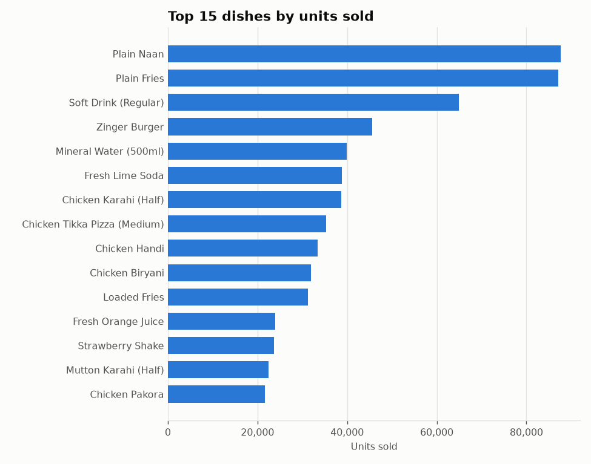

| Dish | Category | Units sold | Revenue (PKR) | Margin | Avg rating |
|---|---|---|---|---|---|
| Plain Naan | Sides & Breads | 87,655 | 5,448,822 | 30.4% | 3.62 |
| Plain Fries | Sides & Breads | 87,102 | 27,790,441 | 35.1% | 3.67 |
| Soft Drink (Regular) | Cold Beverages & Shakes | 64,861 | 10,158,561 | 32.3% | 3.92 |
| Zinger Burger | Burgers & Wraps | 45,630 | 30,673,765 | 30.3% | 3.54 |
| Mineral Water (500ml) | Cold Beverages & Shakes | 39,854 | 4,059,409 | 32.1% | 4.00 |
| Fresh Lime Soda | Cold Beverages & Shakes | 38,787 | 10,068,668 | 57.9% | 3.68 |
| Chicken Karahi (Half) | Karahi & Handi | 38,716 | 55,987,138 | 58.9% | 4.10 |
| Chicken Tikka Pizza (Medium) | Pizza | 35,362 | 51,983,381 | 29.5% | 3.56 |
| Chicken Handi | Karahi & Handi | 33,386 | 46,728,105 | 58.7% | 3.66 |
| Chicken Biryani | Rice & Biryani | 31,877 | 21,306,480 | 32.6% | 3.64 |
| Loaded Fries | Sides & Breads | 31,314 | 24,031,549 | 59.1% | 3.96 |
| Fresh Orange Juice | Cold Beverages & Shakes | 23,898 | 10,801,469 | 66.9% | 3.63 |
| Strawberry Shake | Cold Beverages & Shakes | 23,706 | 11,381,822 | 62.0% | 3.86 |
| Mutton Karahi (Half) | Karahi & Handi | 22,479 | 58,637,744 | 58.1% | 3.46 |
| Chicken Pakora | Appetizers | 21,662 | 12,600,445 | 62.9% | 3.92 |

### 1.2 Lowest-selling dishes

6 of the 15 lowest-selling dishes were launched during the year, mostly in Q4.
Their totals reflect limited time on the menu, not weak demand. The per-day rate is the fairer
comparison.

| Dish | Category | Units sold | Units/day on menu | Launched | Revenue (PKR) |
|---|---|---|---|---|---|
| Pink Sauce Pasta | Pasta | 728 | 10.0 | 2025-10-20 | 828,884 |
| Kunafa Cheesecake | Desserts | 844 | 27.2 | 2025-12-01 | 749,885 |
| Korean Fried Chicken Burger | Burgers & Wraps | 854 | 14.5 | 2025-11-03 | 903,866 |
| Fish and Chips | Seafood | 1,084 | 3.0 | 2020-12-15 | 1,507,319 |
| Chicken Wings Bucket | Appetizers | 1,173 | 3.2 | 2021-10-11 | 1,675,052 |
| Nashville Hot Wrap | Burgers & Wraps | 1,239 | 32.6 | 2025-11-24 | 1,102,255 |
| Truffle Mushroom Pasta | Pasta | 1,266 | 3.5 | 2022-09-30 | 2,237,934 |
| Brownie Sundae | Desserts | 1,266 | 3.5 | 2018-12-06 | 776,099 |
| Molten Lava Cake | Desserts | 1,512 | 4.1 | 2023-07-08 | 1,180,505 |
| Smash Burger | Burgers & Wraps | 1,576 | 18.1 | 2025-10-06 | 1,902,532 |
| Lotus Biscoff Shake | Cold Beverages & Shakes | 1,601 | 30.8 | 2025-11-10 | 1,120,393 |
| Baked Chicken Penne | Pasta | 1,793 | 4.9 | 2017-06-24 | 2,174,286 |
| Thai Tom Yum Soup | Soups | 1,843 | 5.0 | 2019-11-06 | 1,209,110 |
| Lemon Butter Fish | Seafood | 1,866 | 5.1 | 2017-10-14 | 3,221,150 |
| Chicken Mac and Cheese | Pasta | 1,903 | 5.2 | 2017-11-11 | 2,175,917 |

Slowest sellers among dishes on the menu for at least 180 days, by units per day:

| Dish | Category | Units/day | Units sold | Margin | Avg rating |
|---|---|---|---|---|---|
| Fish and Chips | Seafood | 3.0 | 1,084 | 66.7% | 4.10 |
| Chicken Wings Bucket | Appetizers | 3.2 | 1,173 | 50.3% | 3.79 |
| Truffle Mushroom Pasta | Pasta | 3.5 | 1,266 | 83.5% | 4.20 |
| Brownie Sundae | Desserts | 3.5 | 1,266 | 45.8% | 3.32 |
| Molten Lava Cake | Desserts | 4.1 | 1,512 | 82.3% | 4.06 |
| Baked Chicken Penne | Pasta | 4.9 | 1,793 | 66.0% | 3.82 |
| Thai Tom Yum Soup | Soups | 5.0 | 1,843 | 55.9% | 3.85 |
| Lemon Butter Fish | Seafood | 5.1 | 1,866 | 64.0% | 3.98 |
| Chicken Mac and Cheese | Pasta | 5.2 | 1,903 | 57.0% | 4.04 |
| Calamari Rings | Seafood | 5.3 | 1,924 | 57.8% | 3.85 |
| Chicken Noodle Soup | Soups | 5.5 | 2,003 | 63.6% | 3.70 |
| Loaded Nachos | Appetizers | 5.5 | 2,022 | 83.9% | 4.04 |
| Caesar Salad | Salads | 5.7 | 2,078 | 65.0% | 3.87 |
| Finger Fish | Seafood | 6.0 | 2,187 | 62.7% | 3.61 |
| Prawn Karahi | Seafood | 6.0 | 2,200 | 67.3% | 4.16 |

### 1.3 Highest-revenue dishes

Karahi and handi dishes lead revenue. Mutton Karahi (Half) is #1 despite
selling fewer units than Chicken Karahi (Half).

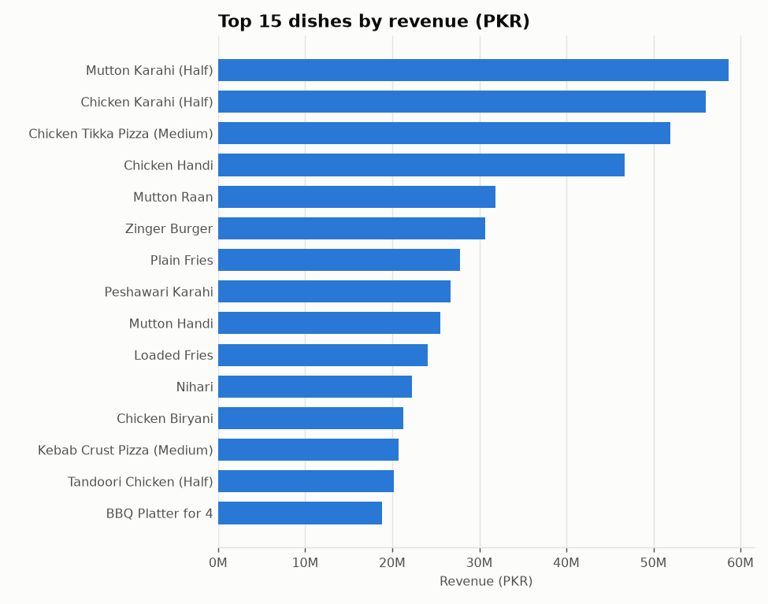

| Dish | Category | Revenue (PKR) | Units sold | Margin |
|---|---|---|---|---|
| Mutton Karahi (Half) | Karahi & Handi | 58,637,744 | 22,479 | 58.1% |
| Chicken Karahi (Half) | Karahi & Handi | 55,987,138 | 38,716 | 58.9% |
| Chicken Tikka Pizza (Medium) | Pizza | 51,983,381 | 35,362 | 29.5% |
| Chicken Handi | Karahi & Handi | 46,728,105 | 33,386 | 58.7% |
| Mutton Raan | BBQ & Grills | 31,813,828 | 6,342 | 59.3% |
| Zinger Burger | Burgers & Wraps | 30,673,765 | 45,630 | 30.3% |
| Plain Fries | Sides & Breads | 27,790,441 | 87,102 | 35.1% |
| Peshawari Karahi | Karahi & Handi | 26,730,277 | 15,954 | 54.9% |
| Mutton Handi | Karahi & Handi | 25,544,052 | 10,362 | 55.0% |
| Loaded Fries | Sides & Breads | 24,031,549 | 31,314 | 59.1% |
| Nihari | Karahi & Handi | 22,290,377 | 17,733 | 67.2% |
| Chicken Biryani | Rice & Biryani | 21,306,480 | 31,877 | 32.6% |
| Kebab Crust Pizza (Medium) | Pizza | 20,728,404 | 11,152 | 61.6% |
| Tandoori Chicken (Half) | BBQ & Grills | 20,208,429 | 16,169 | 60.1% |
| BBQ Platter for 4 | BBQ & Grills | 18,817,169 | 3,870 | 48.3% |

### 1.4 Highest-profit dishes (contribution margin in PKR)

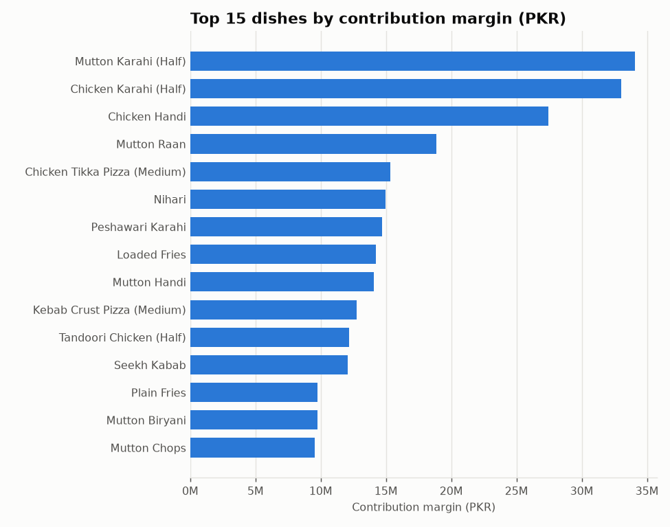

| Dish | Category | Contribution margin (PKR) | Revenue (PKR) | Margin | Units sold |
|---|---|---|---|---|---|
| Mutton Karahi (Half) | Karahi & Handi | 34,076,182 | 58,637,744 | 58.1% | 22,479 |
| Chicken Karahi (Half) | Karahi & Handi | 33,002,964 | 55,987,138 | 58.9% | 38,716 |
| Chicken Handi | Karahi & Handi | 27,421,532 | 46,728,105 | 58.7% | 33,386 |
| Mutton Raan | BBQ & Grills | 18,881,476 | 31,813,828 | 59.3% | 6,342 |
| Chicken Tikka Pizza (Medium) | Pizza | 15,346,579 | 51,983,381 | 29.5% | 35,362 |
| Nihari | Karahi & Handi | 14,974,601 | 22,290,377 | 67.2% | 17,733 |
| Peshawari Karahi | Karahi & Handi | 14,676,365 | 26,730,277 | 54.9% | 15,954 |
| Loaded Fries | Sides & Breads | 14,208,978 | 24,031,549 | 59.1% | 31,314 |
| Mutton Handi | Karahi & Handi | 14,047,297 | 25,544,052 | 55.0% | 10,362 |
| Kebab Crust Pizza (Medium) | Pizza | 12,760,044 | 20,728,404 | 61.6% | 11,152 |
| Tandoori Chicken (Half) | BBQ & Grills | 12,142,949 | 20,208,429 | 60.1% | 16,169 |
| Seekh Kabab | BBQ & Grills | 12,060,927 | 18,546,806 | 65.0% | 21,655 |
| Plain Fries | Sides & Breads | 9,755,702 | 27,790,441 | 35.1% | 87,102 |
| Mutton Biryani | Rice & Biryani | 9,752,816 | 14,845,717 | 65.7% | 13,493 |
| Mutton Chops | BBQ & Grills | 9,522,529 | 16,510,666 | 57.7% | 7,192 |

### 1.5 Highest-margin and lowest-margin dishes

The highest-margin dishes are mostly beverages and desserts. 12 of the
15 sit in the bottom half by volume.

| Dish | Category | Margin | Contribution margin (PKR) | Units sold | Popularity pct. |
|---|---|---|---|---|---|
| Cafe Latte | Hot Beverages | 85.8% | 1,056,855 | 2,489 | 0.16 |
| Blue Lagoon | Cold Beverages & Shakes | 85.1% | 1,557,074 | 4,131 | 0.33 |
| Tiramisu | Desserts | 84.4% | 2,515,147 | 3,288 | 0.22 |
| Cappuccino | Hot Beverages | 84.2% | 1,121,220 | 2,759 | 0.20 |
| Loaded Nachos | Appetizers | 83.9% | 1,674,570 | 2,022 | 0.11 |
| Truffle Mushroom Pasta | Pasta | 83.5% | 1,867,599 | 1,266 | 0.04 |
| Mint Margarita | Cold Beverages & Shakes | 82.7% | 2,737,920 | 8,455 | 0.61 |
| Molten Lava Cake | Desserts | 82.3% | 971,807 | 1,512 | 0.05 |
| Kulfi | Desserts | 69.0% | 746,282 | 3,934 | 0.30 |
| Falooda | Desserts | 68.9% | 1,749,898 | 4,243 | 0.35 |
| Grilled Chicken Salad | Salads | 67.5% | 3,578,427 | 5,535 | 0.45 |
| Quinoa Power Bowl | Salads | 67.3% | 3,552,454 | 4,738 | 0.39 |
| Prawn Karahi | Seafood | 67.3% | 3,827,232 | 2,200 | 0.13 |
| Nihari | Karahi & Handi | 67.2% | 14,974,601 | 17,733 | 0.88 |
| Fresh Orange Juice | Cold Beverages & Shakes | 66.9% | 7,222,534 | 23,898 | 0.93 |

The lowest-margin list is the mirror image. Most of it is the menu's highest-volume staples, followed
by large combo/platter items that lean on promotions.

| Dish | Category | Margin | Units sold | Popularity pct. |
|---|---|---|---|---|
| Doodh Patti Chai | Hot Beverages | 28.9% | 21,390 | 0.90 |
| Chicken Tikka Pizza (Medium) | Pizza | 29.5% | 35,362 | 0.96 |
| Zinger Burger | Burgers & Wraps | 30.3% | 45,630 | 0.98 |
| Plain Naan | Sides & Breads | 30.4% | 87,655 | 1.00 |
| Mineral Water (500ml) | Cold Beverages & Shakes | 32.1% | 39,854 | 0.97 |
| Soft Drink (Regular) | Cold Beverages & Shakes | 32.3% | 64,861 | 0.99 |
| Chicken Biryani | Rice & Biryani | 32.6% | 31,877 | 0.94 |
| Plain Fries | Sides & Breads | 35.1% | 87,102 | 0.99 |
| Jumbo Family Pizza | Pizza | 43.4% | 3,545 | 0.25 |
| Brownie Sundae | Desserts | 45.8% | 1,266 | 0.04 |
| Double Patty Burger | Burgers & Wraps | 46.7% | 3,269 | 0.21 |
| BBQ Platter for 4 | BBQ & Grills | 48.3% | 3,870 | 0.29 |
| Chicken Wings Bucket | Appetizers | 50.3% | 1,173 | 0.03 |
| Chicken Fried Rice | Rice & Biryani | 51.0% | 8,951 | 0.63 |
| Chicken Tikka | BBQ & Grills | 52.6% | 9,113 | 0.67 |

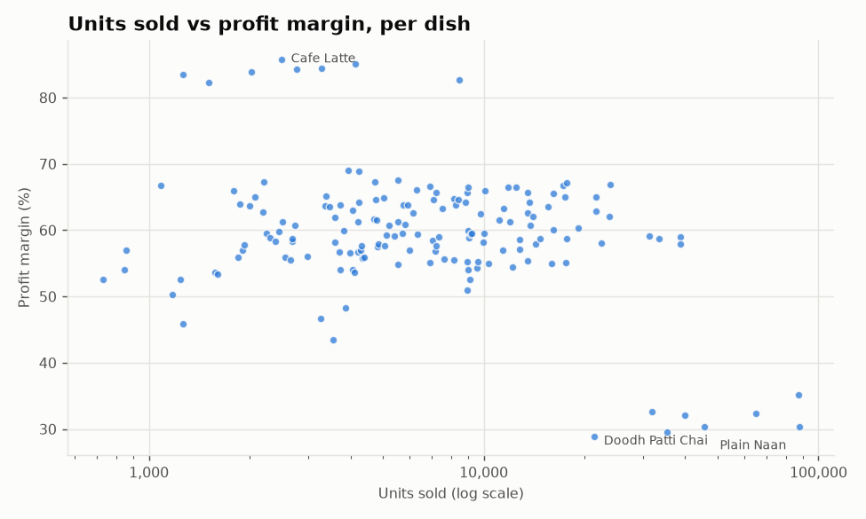

### 1.6 High-wastage dishes

Wastage rate = wasted portions / (wasted + sold portions). The waste log records kg, liters or pieces.
Wasted quantity is converted to portions through its cost (waste cost / average unit cost). Two
groups stand out:

- promotion-dependent, low-volume dishes (Chicken Wings Bucket, Brownie Sundae, Double Patty Burger, Jumbo Family Pizza; half or more
  of their revenue comes from promotion orders), where kitchens prepare for promotional demand that
  often does not arrive;
- high-volume curries and grills (Mutton Karahi (Half), Chicken Karahi (Half), Chicken Handi, Seekh Kabab), at
  19%-20% wasted, which
  make up most of the waste in PKR.

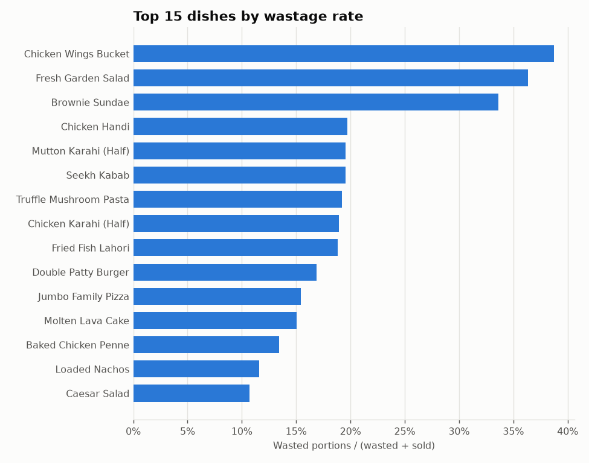

| Dish | Category | Wastage rate | Wastage cost (PKR) | Units sold | Promo revenue share |
|---|---|---|---|---|---|
| Chicken Wings Bucket | Appetizers | 38.7% | 525,878 | 1,173 | 74.7% |
| Fresh Garden Salad | Salads | 36.4% | 1,013,431 | 8,905 | 18.1% |
| Brownie Sundae | Desserts | 33.6% | 212,986 | 1,266 | 56.3% |
| Chicken Handi | Karahi & Handi | 19.7% | 4,733,201 | 33,386 | 19.1% |
| Mutton Karahi (Half) | Karahi & Handi | 19.6% | 5,974,610 | 22,479 | 19.9% |
| Seekh Kabab | BBQ & Grills | 19.5% | 1,573,843 | 21,655 | 19.1% |
| Truffle Mushroom Pasta | Pasta | 19.2% | 87,996 | 1,266 | 14.8% |
| Chicken Karahi (Half) | Karahi & Handi | 19.0% | 5,376,754 | 38,716 | 18.9% |
| Fried Fish Lahori | Seafood | 18.8% | 1,084,533 | 7,623 | 15.8% |
| Double Patty Burger | Burgers & Wraps | 16.9% | 415,279 | 3,269 | 66.5% |
| Jumbo Family Pizza | Pizza | 15.5% | 936,846 | 3,545 | 68.7% |
| Molten Lava Cake | Desserts | 15.0% | 36,971 | 1,512 | 15.0% |
| Baked Chicken Penne | Pasta | 13.4% | 114,755 | 1,793 | 16.8% |
| Loaded Nachos | Appetizers | 11.6% | 42,249 | 2,022 | 19.2% |
| Caesar Salad | Salads | 10.7% | 69,310 | 2,078 | 15.1% |

Ranked by wastage cost:

| Dish | Category | Wastage cost (PKR) | Wastage rate | Units sold |
|---|---|---|---|---|
| Mutton Karahi (Half) | Karahi & Handi | 5,974,610 | 19.6% | 22,479 |
| Chicken Karahi (Half) | Karahi & Handi | 5,376,754 | 19.0% | 38,716 |
| Chicken Handi | Karahi & Handi | 4,733,201 | 19.7% | 33,386 |
| Seekh Kabab | BBQ & Grills | 1,573,843 | 19.5% | 21,655 |
| Fried Fish Lahori | Seafood | 1,084,533 | 18.8% | 7,623 |
| Fresh Garden Salad | Salads | 1,013,431 | 36.4% | 8,905 |
| Jumbo Family Pizza | Pizza | 936,846 | 15.5% | 3,545 |
| Chicken Wings Bucket | Appetizers | 525,878 | 38.7% | 1,173 |
| Double Patty Burger | Burgers & Wraps | 415,279 | 16.9% | 3,269 |
| Chicken Tikka Pizza (Medium) | Pizza | 321,737 | 0.9% | 35,362 |
| Beef Lasagna | Pasta | 302,333 | 9.8% | 4,052 |
| Brownie Sundae | Desserts | 212,986 | 33.6% | 1,266 |
| BBQ Platter for 4 | BBQ & Grills | 184,854 | 1.9% | 3,870 |
| Zinger Burger | Burgers & Wraps | 168,592 | 0.8% | 45,630 |
| Seafood Pizza (Medium) | Pizza | 156,844 | 3.6% | 4,829 |

### 1.7 Best-rated dishes

Dishes with at least 30 ratings. Rating trend is the slope of monthly average rating,
in points per month.

| Dish | Category | Avg rating | Ratings | Trend / month | Units sold |
|---|---|---|---|---|---|
| Margherita Pizza (Medium) | Pizza | 4.27 | 299 | +0.006 | 5,019 |
| Chicken Wings (6 pcs) | Appetizers | 4.24 | 228 | -0.020 | 3,591 |
| Hot Chocolate | Hot Beverages | 4.22 | 550 | +0.002 | 12,529 |
| Truffle Mushroom Pasta | Pasta | 4.20 | 71 | -0.007 | 1,266 |
| Beef Bihari Boti | BBQ & Grills | 4.19 | 264 | +0.009 | 3,997 |
| Prawn Karahi | Seafood | 4.16 | 134 | -0.007 | 2,200 |
| Cafe Latte | Hot Beverages | 4.16 | 112 | +0.004 | 2,489 |
| Tiramisu | Desserts | 4.16 | 179 | +0.012 | 3,288 |
| Pepperoni Pizza (Medium) | Pizza | 4.12 | 335 | +0.002 | 5,396 |
| Grilled Prawns Platter | Seafood | 4.12 | 127 | -0.028 | 2,393 |
| Cappuccino | Hot Beverages | 4.12 | 130 | +0.030 | 2,759 |
| Chicken Karahi (Half) | Karahi & Handi | 4.10 | 2,181 | -0.003 | 38,716 |
| Fish and Chips | Seafood | 4.10 | 73 | +0.001 | 1,084 |
| Molten Lava Cake | Desserts | 4.06 | 96 | -0.015 | 1,512 |
| Grilled Chicken Salad | Salads | 4.06 | 323 | -0.008 | 5,535 |

### 1.8 Poorly rated dishes

The bottom 5 are a distinct group, well below everything else, and their trends are
flat: they are not recovering. They still sell (34,379 units
combined), so they are candidates for recipe review rather than removal on volume grounds alone.

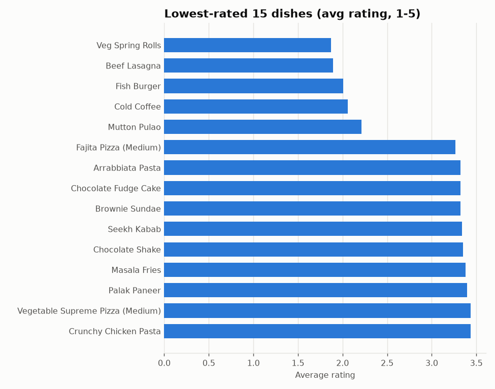

| Dish | Category | Avg rating | Ratings | Trend / month | Units sold | Repeat rate |
|---|---|---|---|---|---|---|
| Veg Spring Rolls | Appetizers | 1.87 | 418 | -0.011 | 4,689 | 9.0% |
| Beef Lasagna | Pasta | 1.89 | 393 | +0.001 | 4,052 | 9.1% |
| Fish Burger | Burgers & Wraps | 2.01 | 479 | -0.011 | 5,205 | 10.1% |
| Cold Coffee | Cold Beverages & Shakes | 2.06 | 592 | -0.000 | 8,973 | 12.1% |
| Mutton Pulao | Rice & Biryani | 2.21 | 980 | -0.006 | 11,460 | 15.6% |
| Fajita Pizza (Medium) | Pizza | 3.26 | 560 | +0.005 | 8,979 | 14.7% |
| Arrabbiata Pasta | Pasta | 3.32 | 203 | -0.000 | 3,351 | 8.1% |
| Chocolate Fudge Cake | Desserts | 3.32 | 254 | +0.004 | 4,299 | 10.4% |
| Brownie Sundae | Desserts | 3.32 | 68 | -0.032 | 1,266 | 1.7% |
| Seekh Kabab | BBQ & Grills | 3.34 | 1,221 | -0.007 | 21,655 | 22.2% |
| Chocolate Shake | Cold Beverages & Shakes | 3.35 | 223 | -0.013 | 4,756 | 9.8% |
| Masala Fries | Sides & Breads | 3.38 | 402 | -0.007 | 9,563 | 11.6% |
| Palak Paneer | Karahi & Handi | 3.40 | 201 | -0.024 | 3,589 | 8.6% |
| Vegetable Supreme Pizza (Medium) | Pizza | 3.44 | 422 | +0.009 | 7,018 | 12.1% |
| Crunchy Chicken Pasta | Pasta | 3.44 | 185 | -0.027 | 2,980 | 8.1% |

## 2. Menu categories

Karahi & Handi is the largest category by revenue
(23.4%). Order reach tells a different story: Sides & Breads and Cold
Beverages appear in over half of all orders but earn a fraction of the revenue. The categories under 50% margin are Pizza, Sides & Breads, Burgers & Wraps.

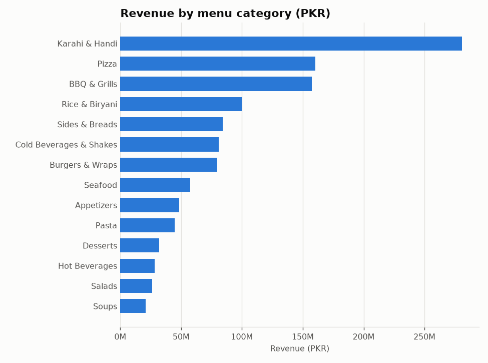

| Category | Revenue (PKR) | Share | Margin | Units | Wastage cost (PKR) |
|---|---|---|---|---|---|
| Karahi & Handi | 280,940,071 | 23.4% | 59.2% | 185,889 | 16,347,108 |
| Pizza | 160,293,283 | 13.4% | 49.5% | 98,158 | 2,449,860 |
| BBQ & Grills | 157,453,528 | 13.1% | 58.6% | 109,635 | 2,026,879 |
| Rice & Biryani | 99,679,384 | 8.3% | 55.8% | 125,096 | 193,735 |
| Sides & Breads | 84,197,362 | 7.0% | 49.4% | 339,277 | 398,662 |
| Cold Beverages & Shakes | 80,892,214 | 6.7% | 58.8% | 268,767 | 162,792 |
| Burgers & Wraps | 79,567,284 | 6.6% | 46.9% | 104,607 | 1,265,279 |
| Seafood | 57,236,458 | 4.8% | 60.6% | 30,876 | 1,205,221 |
| Appetizers | 48,588,299 | 4.0% | 61.8% | 88,890 | 1,141,306 |
| Pasta | 44,544,137 | 3.7% | 61.0% | 34,982 | 1,147,726 |
| Desserts | 31,841,160 | 2.7% | 63.5% | 69,042 | 602,748 |
| Hot Beverages | 28,172,197 | 2.3% | 58.5% | 95,963 | 67,424 |
| Salads | 26,299,837 | 2.2% | 63.6% | 43,000 | 1,459,145 |
| Soups | 20,725,151 | 1.7% | 59.7% | 37,465 | 53,646 |

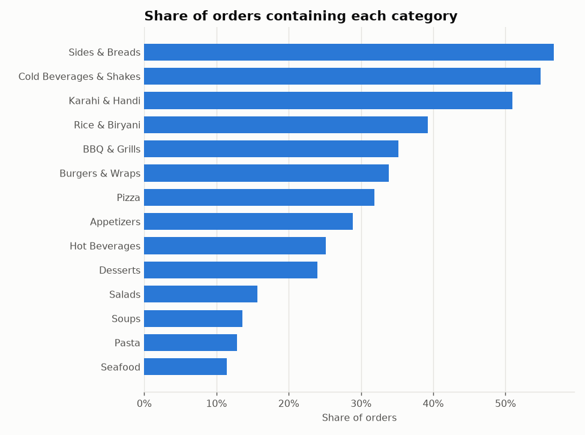

| Category | Orders containing | Share of orders | Units |
|---|---|---|---|
| Sides & Breads | 101,704 | 56.7% | 339,277 |
| Cold Beverages & Shakes | 98,416 | 54.9% | 268,767 |
| Karahi & Handi | 91,362 | 50.9% | 185,889 |
| Rice & Biryani | 70,408 | 39.3% | 125,096 |
| BBQ & Grills | 63,028 | 35.1% | 109,635 |
| Burgers & Wraps | 60,746 | 33.9% | 104,607 |
| Pizza | 57,106 | 31.8% | 98,158 |
| Appetizers | 51,764 | 28.9% | 88,890 |
| Hot Beverages | 45,105 | 25.2% | 95,963 |
| Desserts | 42,957 | 24.0% | 69,042 |
| Salads | 28,062 | 15.6% | 43,000 |
| Soups | 24,338 | 13.6% | 37,465 |
| Pasta | 23,096 | 12.9% | 34,982 |
| Seafood | 20,533 | 11.5% | 30,876 |

## 3. Peak ordering periods

Two daily peaks: lunch (12:00-14:00) and a larger dinner peak (19:00-22:00), together
56% of orders. The busiest hours are
20:00 (12.8%), 21:00 (11.8%), 13:00 (11.4%), 19:00 (10.5%), 12:00 (9.4%). Saturday is the busiest day
(624 orders/day against 398 on Tuesday).

Ramadan (March) reshapes the day. Lunch drops to 2.8% of orders (vs
22.2% in other months), and the peak moves to the iftar hour, 18:00.
Staffing and prep schedules built on the normal lunch peak do not apply in that month.

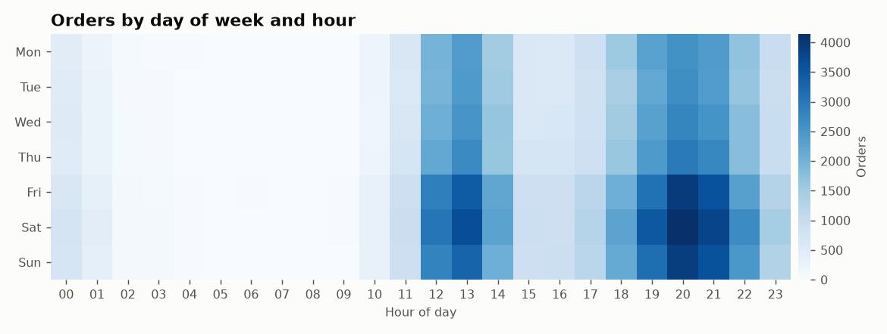

| Day | Avg orders/day | Share of week |
|---|---|---|
| Mon | 403 | 11.7% |
| Tue | 398 | 11.6% |
| Wed | 413 | 12.0% |
| Thu | 442 | 12.9% |
| Fri | 580 | 16.8% |
| Sat | 624 | 18.1% |
| Sun | 581 | 16.9% |

## 4. Location-wise sales patterns

Mall locations earn the most per site, and highway sites the least, though highway sites have the
highest average order value (7,353 PKR). Highway sites
also have the highest wastage rate (3.3% of revenue) and the
lowest repeat-customer rate, consistent with transient traffic. Downtown sites are the least
weekend-dependent (44% of orders on Fri-Sun vs
56% for malls) and have the strongest lunch trade
(25%).

| Type | Sites | Revenue / site (PKR) | AOV (PKR) | Weekend share | Lunch share | Dinner share | Repeat-customer rate | Wastage / revenue |
|---|---|---|---|---|---|---|---|---|
| Mall | 4 | 62,308,275 | 6,961 | 56.4% | 19.3% | 36.2% | 25.2% | 2.3% |
| Downtown | 5 | 57,183,421 | 6,488 | 44.0% | 25.3% | 32.4% | 25.0% | 2.2% |
| Urban | 7 | 46,900,270 | 6,672 | 52.5% | 19.4% | 36.5% | 24.0% | 2.5% |
| Suburban | 6 | 42,009,284 | 6,482 | 55.4% | 19.8% | 36.2% | 23.9% | 2.4% |
| Highway | 3 | 28,307,522 | 7,353 | 50.8% | 17.1% | 32.2% | 21.8% | 3.3% |

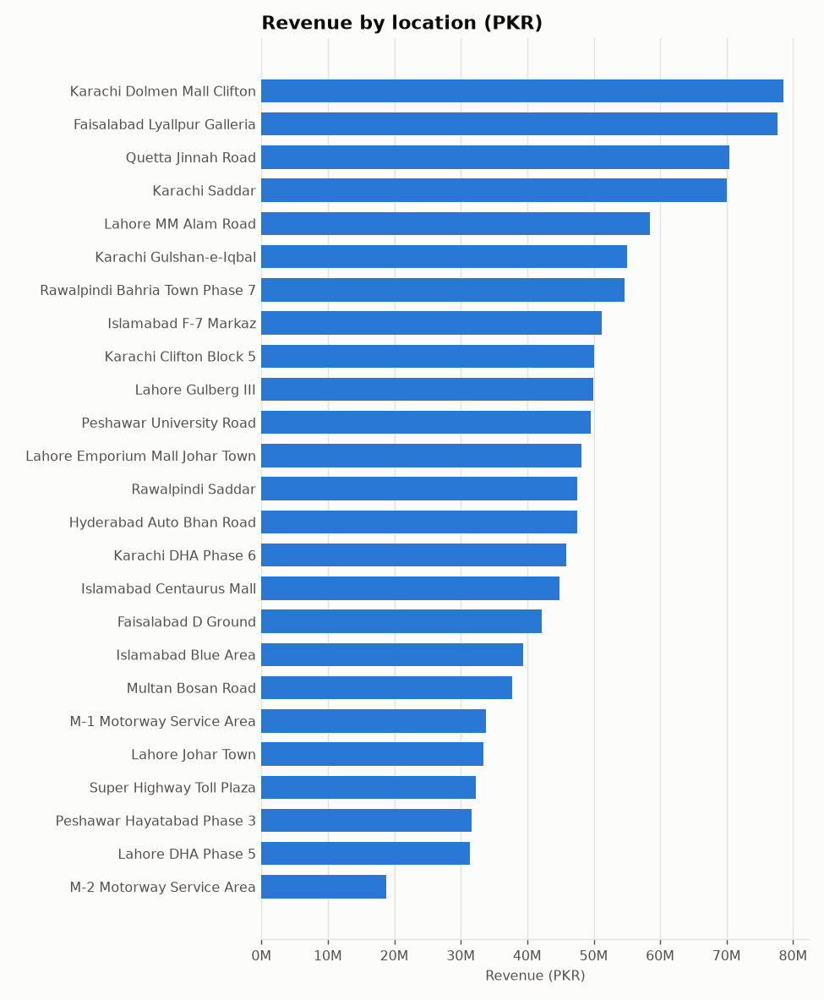

| Location | City | Type | Revenue (PKR) | Margin | AOV (PKR) | Customers | Repeat rate | Wastage / revenue |
|---|---|---|---|---|---|---|---|---|
| DineIQ Karachi Dolmen Mall Clifton | Karachi | Mall | 78,497,203 | 57.2% | 6,728 | 5,717 | 26.3% | 2.0% |
| DineIQ Faisalabad Lyallpur Galleria | Faisalabad | Mall | 77,683,747 | 57.3% | 7,367 | 5,296 | 26.7% | 2.5% |
| DineIQ Quetta Jinnah Road | Quetta | Downtown | 70,423,225 | 56.3% | 6,745 | 5,049 | 26.3% | 1.9% |
| DineIQ Karachi Saddar | Karachi | Downtown | 70,069,749 | 56.4% | 6,562 | 5,258 | 25.9% | 1.8% |
| DineIQ Lahore MM Alam Road | Lahore | Downtown | 58,433,823 | 55.3% | 6,374 | 4,555 | 25.3% | 2.5% |
| DineIQ Karachi Gulshan-e-Iqbal | Karachi | Suburban | 55,079,497 | 56.4% | 6,525 | 4,111 | 25.0% | 2.1% |
| DineIQ Rawalpindi Bahria Town Phase 7 | Rawalpindi | Suburban | 54,704,621 | 55.2% | 6,258 | 4,347 | 25.6% | 2.2% |
| DineIQ Islamabad F-7 Markaz | Islamabad | Urban | 51,253,423 | 56.7% | 6,619 | 4,020 | 23.5% | 2.7% |
| DineIQ Karachi Clifton Block 5 | Karachi | Urban | 50,070,146 | 55.8% | 6,725 | 3,779 | 24.9% | 2.0% |
| DineIQ Lahore Gulberg III | Lahore | Urban | 49,968,615 | 56.3% | 6,625 | 3,955 | 23.7% | 2.6% |
| DineIQ Peshawar University Road | Peshawar | Urban | 49,557,799 | 56.7% | 6,845 | 3,569 | 25.0% | 2.4% |
| DineIQ Lahore Emporium Mall Johar Town | Lahore | Mall | 48,212,692 | 56.8% | 7,048 | 3,415 | 23.8% | 2.4% |
| DineIQ Rawalpindi Saddar | Rawalpindi | Downtown | 47,572,160 | 56.6% | 6,640 | 3,676 | 24.8% | 2.1% |
| DineIQ Hyderabad Auto Bhan Road | Hyderabad | Urban | 47,511,470 | 56.8% | 6,916 | 3,454 | 23.8% | 2.4% |
| DineIQ Karachi DHA Phase 6 | Karachi | Suburban | 45,922,692 | 56.0% | 6,614 | 3,525 | 24.8% | 2.4% |
| DineIQ Islamabad Centaurus Mall | Islamabad | Mall | 44,839,457 | 57.0% | 6,702 | 3,456 | 23.9% | 2.4% |
| DineIQ Faisalabad D Ground | Faisalabad | Urban | 42,190,092 | 57.0% | 6,435 | 3,461 | 23.3% | 2.5% |
| DineIQ Islamabad Blue Area | Islamabad | Downtown | 39,418,148 | 55.7% | 6,122 | 3,299 | 22.7% | 2.7% |
| DineIQ Multan Bosan Road | Multan | Urban | 37,750,345 | 56.3% | 6,539 | 2,934 | 23.4% | 2.6% |
| DineIQ M-1 Motorway Service Area | Nowshera | Highway | 33,817,291 | 56.7% | 7,395 | 2,344 | 22.6% | 3.3% |
| DineIQ Lahore Johar Town | Lahore | Suburban | 33,449,078 | 56.3% | 6,584 | 2,643 | 22.6% | 2.5% |
| DineIQ Super Highway Toll Plaza | Karachi | Highway | 32,281,506 | 56.5% | 7,413 | 2,359 | 21.8% | 2.7% |
| DineIQ Peshawar Hayatabad Phase 3 | Peshawar | Suburban | 31,569,462 | 56.5% | 6,576 | 2,438 | 22.2% | 2.9% |
| DineIQ Lahore DHA Phase 5 | Lahore | Suburban | 31,330,356 | 56.3% | 6,332 | 2,514 | 23.0% | 2.7% |
| DineIQ M-2 Motorway Service Area | Bhera | Highway | 18,823,769 | 57.1% | 7,251 | 1,366 | 21.1% | 3.9% |

## 5. Channel-wise ordering patterns

Dine-in orders are the largest (8,284 PKR,
6.1 lines on average). Delivery and takeaway orders are
around 5,463-5,892 PKR.
Margin is essentially identical across channels. The channel difference is in order size and
cancellation: third-party delivery cancels 4.2x
as often as dine-in. Timing does not differ by channel; every channel does about
56% of its orders in peak hours.

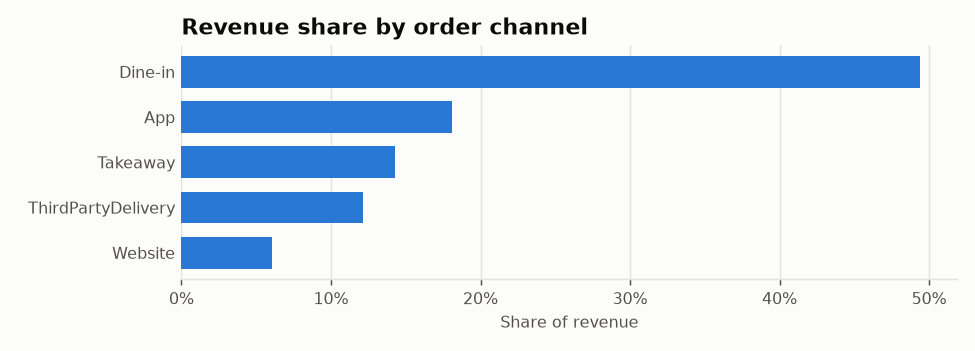

| Channel | Orders | Revenue (PKR) | Share | AOV (PKR) | Lines/order | Margin | Cancel rate | Promo orders | Peak-hour share |
|---|---|---|---|---|---|---|---|---|---|
| Dine-in | 71,622 | 593,333,197 | 49.4% | 8,284 | 6.1 | 56.6% | 1.9% | 19.2% | 55.7% |
| App | 36,810 | 216,879,151 | 18.1% | 5,892 | 5.1 | 56.3% | 6.0% | 17.4% | 56.3% |
| Takeaway | 31,433 | 171,707,672 | 14.3% | 5,463 | 4.8 | 56.4% | 3.0% | 16.7% | 55.8% |
| ThirdPartyDelivery | 26,967 | 145,495,078 | 12.1% | 5,395 | 4.7 | 56.3% | 8.1% | 16.4% | 56.1% |
| Website | 12,492 | 73,015,268 | 6.1% | 5,845 | 5.1 | 56.3% | 6.1% | 17.4% | 55.4% |

Customers' most-used channel:

| Preferred channel | Share of customers |
|---|---|
| Dine-in | 41.5% |
| App | 23.4% |
| Takeaway | 15.4% |
| ThirdPartyDelivery | 13.7% |
| Website | 6.0% |

## 6. Promotion-driven sales

Two views. First, orders that used a promotion against those that did not:

| Order type | Orders | Revenue (PKR) | Revenue share | AOV (PKR) | Margin |
|---|---|---|---|---|---|
| Promotion order | 31,979 | 226,172,220 | 18.8% | 7,073 | 51.4% |
| No promotion | 147,304 | 974,258,145 | 81.2% | 6,614 | 57.6% |

Second, revenue by location-day, depending on whether a promotion was running at that location on that
day. Promotions run on most days of the year, so "outside" is the smaller group:

| Period | Location-days | Revenue share | Avg revenue / location-day (PKR) | Avg orders / location-day |
|---|---|---|---|---|
| During a promotion period | 7,888 | 89.2% | 135,778 | 20.3 |
| Outside promotion periods | 1,237 | 10.8% | 104,621 | 15.4 |

Promotion orders carry larger baskets (higher AOV) but 6.2
points less margin. The weakest campaigns on margin are
Black Friday Mega Sale (39%), Spring Pizza Fest (40%), August BOGO Blast (42%),
all BOGO or deep percentage-off.

The August BOGO Blast is the clearest case. August was the second-highest revenue month
(138.5M), but it had the year's lowest gross margin
(53.9%) and by far the highest wastage cost
(6.6M PKR, 3.6x July). The waste spike
is consistent with kitchens over-preparing for the campaign. The volume gain came with margin and waste costs that the revenue
line alone does not show.

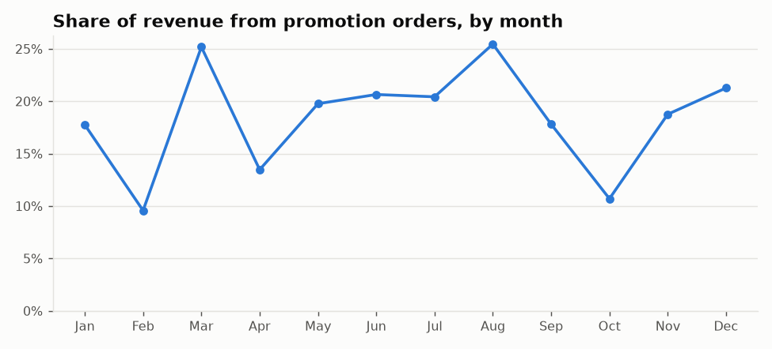

| Month | Orders | Customers | Revenue (PKR) | Promo revenue share | Margin | Wastage cost (PKR) |
|---|---|---|---|---|---|---|
| Jan | 14,675 | 10,829 | 90,880,714 | 17.7% | 57.2% | 1,950,968 |
| Feb | 13,021 | 9,920 | 83,580,100 | 9.6% | 57.6% | 1,626,687 |
| Mar | 13,512 | 10,272 | 93,988,819 | 25.2% | 56.9% | 2,334,780 |
| Apr | 14,878 | 11,008 | 100,355,320 | 13.5% | 55.4% | 1,865,130 |
| May | 14,840 | 10,921 | 94,328,132 | 19.8% | 56.8% | 1,948,363 |
| Jun | 13,109 | 9,910 | 85,193,763 | 20.6% | 56.9% | 1,733,613 |
| Jul | 13,128 | 9,940 | 85,315,519 | 20.4% | 57.4% | 1,858,133 |
| Aug | 20,681 | 13,668 | 138,480,860 | 25.5% | 53.9% | 6,598,509 |
| Sep | 11,923 | 9,043 | 81,466,971 | 17.8% | 56.5% | 1,874,498 |
| Oct | 12,756 | 9,650 | 89,073,224 | 10.7% | 56.6% | 1,922,290 |
| Nov | 16,318 | 12,224 | 114,400,036 | 18.8% | 55.7% | 2,031,914 |
| Dec | 20,442 | 15,038 | 143,366,908 | 21.3% | 57.7% | 2,776,646 |

By campaign:

| Promotion | Type | Orders | Revenue (PKR) | Margin |
|---|---|---|---|---|
| August BOGO Blast | BOGO | 4,660 | 33,294,250 | 42.3% |
| Summer Coolers | PercentOff | 5,140 | 29,681,949 | 55.6% |
| Ramadan Iftar Deal | FixedAmountOff | 2,512 | 22,860,042 | 55.9% |
| Winter Soup Season | PercentOff | 3,155 | 21,657,681 | 57.5% |
| Monsoon Munchies | FixedAmountOff | 2,664 | 16,622,671 | 56.7% |
| Family Platter Month | ComboDeal | 1,983 | 16,352,351 | 47.9% |
| Winter Warmers | PercentOff | 2,607 | 15,929,703 | 56.9% |
| App Exclusive Fest | PercentOff | 1,811 | 11,961,780 | 45.9% |
| Spring Pizza Fest | BOGO | 1,107 | 9,341,650 | 40.2% |
| Year End Celebration | FixedAmountOff | 960 | 8,824,592 | 54.0% |
| Back to Work Lunch | FixedAmountOff | 1,054 | 7,671,779 | 54.4% |
| New Year Kickoff | PercentOff | 1,037 | 6,655,479 | 50.5% |
| Black Friday Mega Sale | PercentOff | 839 | 5,102,976 | 38.6% |
| Eid Family Feast | ComboDeal | 504 | 4,976,272 | 49.9% |
| Highway Traveler Deal | FixedAmountOff | 513 | 4,133,333 | 55.6% |
| Mall Mania | PercentOff | 403 | 2,877,322 | 52.3% |
| Eid ul Adha BBQ Nights | PercentOff | 317 | 2,765,856 | 53.2% |
| Pasta Week | PercentOff | 312 | 2,523,695 | 56.2% |
| Valentine Dinner Combo | ComboDeal | 195 | 1,543,657 | 51.4% |
| Independence Day 14% Off | PercentOff | 206 | 1,395,182 | 49.7% |

## 7. Customer overview

43% of ordering customers have ordered only once. The top 10% of customers by spend
account for 44% of customer spend. These customer features feed the segmentation step.

| Feature | Mean | P25 | Median | P75 | P90 | P99 |
|---|---|---|---|---|---|---|
| customer_recency | 113.75 | 22.00 | 80.00 | 191.00 | 277.00 | 352.00 |
| customer_frequency | 3.61 | 1.00 | 2.00 | 4.00 | 9.00 | 20.00 |
| customer_monetary_value | 28,393.62 | 6,842.50 | 14,133.15 | 32,958.15 | 67,951.73 | 191,348.37 |
| average_order_value | 7,428.90 | 5,083.00 | 6,998.73 | 9,214.45 | 11,747.16 | 18,749.43 |
| basket_size_avg | 5.25 | 4.00 | 5.00 | 6.00 | 7.00 | 10.00 |
| peak_hour_frequency | 0.56 | 0.25 | 0.57 | 1.00 | 1.00 | 1.00 |
| weekend_order_ratio | 0.52 | 0.00 | 0.50 | 1.00 | 1.00 | 1.00 |

## Method notes

- Features are computed as of 2025-12-31 and use only records dated on or before it. An earlier
  snapshot (2025-09-30) exists to validate the as-of logic. Later forecasting steps recompute
  features at their own cutoffs.
- Cancelled orders are excluded from revenue, volume, margin and customer metrics. They are kept only
  for the channel cancellation rate.
- Contribution margin = line revenue (after line discounts) - quantity x unit cost. Tax is excluded.
- Peak hours: 12:00-13:59 and 19:00-21:59. 14:00 and 22:00 are busy shoulder hours but fall outside
  the windows.
- `price_change_percentage` uses chain-wide Pricing_History rows only. Location premium rows are
  excluded.
